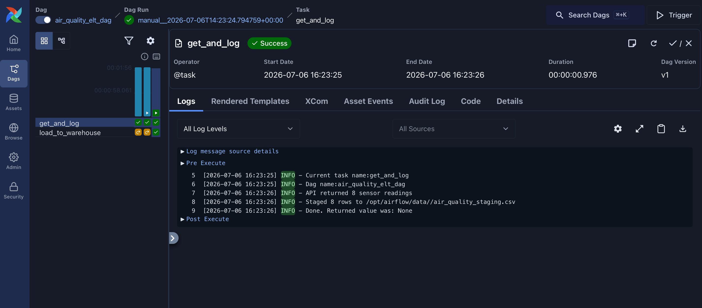
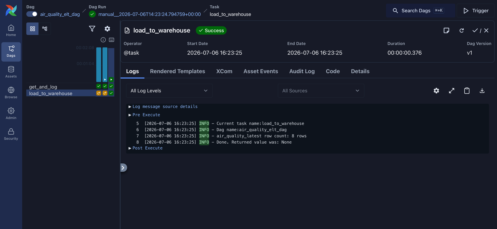
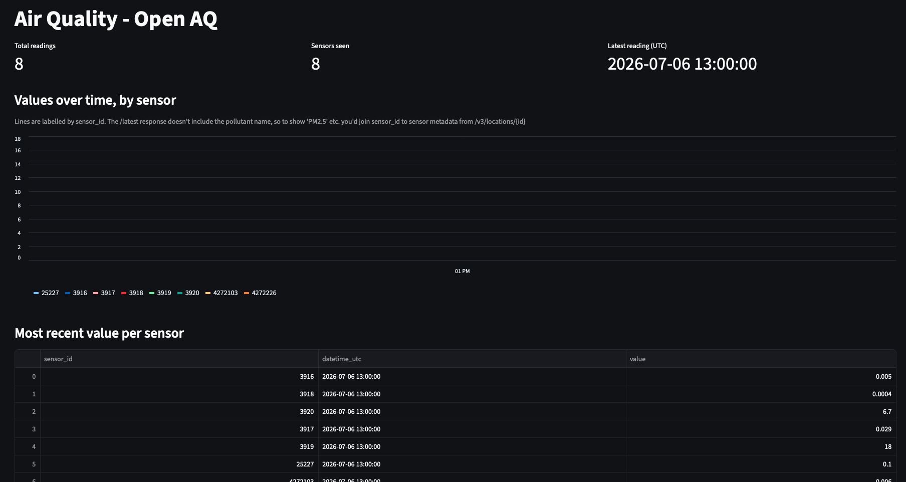

# Air Quality Pipeline

An airflow pipeline for air quality data, sourced from Open AQ.
The project contains two DAGS:
1. Ping DAG that runs a periodic health check
2. Air quality DAG that extracts data from an endpoint and loads it into a duckdb data warehouse

A streamlit dashboard for visualizing the data is also included (still in progress though).

## Setup
To get an api key, create an account at open AQ. Then add the following to a .env file in the project root:
```
OPENAQ_API_KEY=""
AIRFLOW_UID=50000
AIRFLOW_GID=0
```

## Running
Install docker desktop, then start airflow:
```
docker compose up
```

## Airflow
### get and log function


### load to warehouse function


To view the dashboard, run:
```
streamlit run dashboard.py
```
## Streamlit Dashboard

